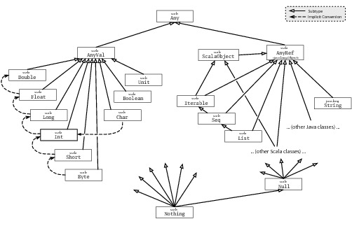

# Chapter 11. 스칼라의 계층구조
* Any 모든 클래스의 슈퍼클래스
* Nothing 다른 모든 클래스의 서브클래스
* 아직 무슨말인지 이해못하겠음

## 01 Scala's class hierarchy


```scala
final def ==(that: Any): Boolean

final def !=(that: Any): Boolean

def equals(that: Any): Boolean

def ##: Int // hashCode

def hashCode: Int 

def toString: String
```

* == method 는 equals 와 같다 

### AnyVal
* 값에 관한 클래스
* new Instance 불가능
* abstract class & final class 
* implicit conversion (RichInt 에 있는 method 들임) 
```scala
scala> 42 max 43
val res4: Int = 43

scala> 3.abs
val res5: Int = 3
```

### AnyRef
* java.lang.Object

## 02 How primitives are implemented
* 기본연산은 자바를 이용한다.
* 필요시 박싱한다.(e.g. toString method call, == 연산)
* ==, eq, ne

## 03 Bottom types
### scala.Null
* null
* AnyVal 값과 호환 되지 않는다.

### scala.Nothing
* 모든 타입의 서브 타입이기 때문에 error 발생시 유용하다.

## 04 Defining your own value classes
* 파라미터는 오직 하나
* def 제외한 필드가 있어서는 안됨
* equals, hashCode 재정의 불가.
```scala
class Dollars(val amount: Int) extends AnyVal {
  override def toString() = "$" + amount
}

scala> val money = new Dollars(1000000)
val money: Dollars = $1000000

scala> money.amount
val res6: Int = 1000000
```
```scala
class SwissFrancs(val amount: Int) extends AnyVal {
  override def toString() = amount + " CHF"
}
```

* 이렇게 하면 뭐가 장점일까?
* 어디에 쓰는 걸까

### 한 가지 타입만 남용하는 것을 막기
* 컴파일러가 잘 알아들을수 있게 분리 해보자
```
def title(text: String, anchor: String, style: String): String =
s"<a id='$anchor'><h1 class='$style'>$text</h1></a>"
```

```
class Anchor(val value: String) extends AnyVal
class Style(val value: String) extends AnyVal
class Text(val value: String) extends AnyVal
class Html(val value: String) extends AnyVal
```

* 인자에 값이 잘못 대응되면 에러가 난다.