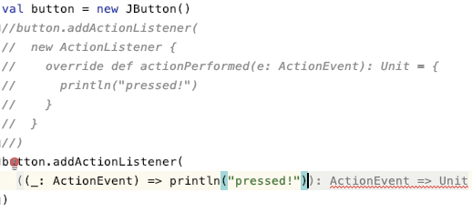

# Chapter 21. 암시적 변환과 암시적 파라미터


## 01. 암시적 변환


- 암시적 변환이 없는 상태.
    - 1단계: 정보가 없는 준비 과정 코드가 많이 있다.

        ```scala
        val button = new JButton()
        button.addActionListener(
          new ActionListener {
            override def actionPerformed(e: ActionEvent): Unit = {
              println("pressed!")
            }
          }
        )
        ```

    - 2단계: 1단계의 스칼라 친화적 버전. 함수를 인자로 받아 얼개 코드 양을 줄인다.

        ```scala
        button.addActionListener(
          (_: ActionEvent) => println("pressed!")
        )
        ```

        그러나 위의 코드는 스칼라 2.12 부터 작동이 가능하다. *31.5절에서 설명 예정*

        

- 2단계 코드가 작동하려면 함수 → 액션 리스너 변경이 필요하다.
    1. 암시적인 변환 방법을 작성해보자.

        ```scala
        implicit def function2ActionListener(f: ActionEvent => Unit) =
          new ActionListener {
            override def actionPerformed(event: ActionEvent): Unit = f(event)
          }
        ```

    2. 인자로 함수를 받아서 액션 리스너를 반환한다.

        ```scala
        button.addActionListener(
          function2ActionListener((_: ActionEvent) => println("pressed!"))
        )
        ```

    3. implicit 표시로 암시적 변환이 되어, 메소드 호출을 생략해도 컴파일러가 자동으로 추가해준다.

        → 이전의 2단계 코드가 작동된다.

## 02. 암시 규칙


- 표시 규칙: implicit로 표시한 정의만 검토 대상이다
    - implicit 키워드는 컴파일러가 암시 처리 시 사용할 선언을 표시한다.
    - 변수, 함수, 객체 정의에 표시할 수 있다.

        ```scala
        implicit def intToString(x: Int) = x.toString
        ```

- 스코프 규칙: 삽입된 implicit 변환은 스코프 내에 단일 식별자로만 존재하거나, 변환이 결과나 원래 타입과 연관이 있어야 한다
    - 스칼라 컴파일러는 스코프 안에 있는 암시적 변환만을 고려한다.
    - 암시적 변환은 단일 식별자로 스코프 안에 존재해야 한다.

        ```
        x + y를 SomeVar.convert(x) + y 로 확장하지 않는다.
        SomeVar.convert 사용하고 싶으면 import 해서 convert(x)로 가리킬 수 있게 만들어야 한다.
        ->
        한 가지 예외는 컴파일러는 **원 타입이나 변환 결과 타입의 동반 객체의 암시적 정의**도 살펴본다.
        이런 경우, 그 암시적 정의는 해당 타입과 **연관이 있다**고 한다.(연관이 있는 변환)
        ```

- 한 번에 하나만 규칙: 오직 하나의 암시적 선언만 사용한다
    - 컴파일러는 다른 암시적 선언을 시도하는 중에 추가로 암시적 선언을 적용하지 않는다.
    - 암시 선언 안에서 암시 파라미터를 사용해 이런 제약을 우회할 수 있다.
- 명시성 우선 규칙: 코드가 그 상태 그대로 타입 검사를 통과한다면 암시를 통한 변환을 시도하지 않는다
    - 따름정리(corollary): 언제든 명시적인 선언을 사용해 암시적 식별자를 대신할 수 잇다.
- 암시적 변환 이름 붙이기
    - 암시적 변환에는 아무 이름이나 붙일 수 있다.
    - 이름을 통해서 특정 암시적 변환 임포트 할 수 있다.

    ```scala
    object MyConversions {
      implicit def stringWrapper(s: String): IndexedSeq[Char] = ...
      implicit def intToString(x: Int): String = ...
    }
    ```

    ```scala
    import MyConversions.stringWrapper
    ... // 사용하는 코드
    ```

## 03. 예상 타입으로의 암시적 변환


- 컴파일러가 Y 타입이 필요한 위치에서 X 타입을 보게 되면, X를 Y로 변환하는 암시적 함수를 찾는다.

    ```scala
    val i: Int = 3.5
    /*
    type mismatch;
    found   : Double(3.5)
    required: Int */
    ```

    - 암시적 변환 정의

    ```scala
    implicit def doubleToInt(x: Double) = x.toInt
    ```

    - 컴파일러가 Int가 필요한 곳에서 Double을 보게 되어 타입 오류를 보는 상황에서, Double을 Int로 바꾸는 암시적 변환이 없는지 찾아본다. → 오류 resolve!
    - 암시적 변환에 써도 좋다 = 단일 식별자로 스코프 내로 가져왔다

## 04. 호출 대상 객체 변환


- 메소드를 호출하는 대상인 수신 객체에 적용하기
    1. 수신 객체 변환을 통해 새 클래스를 기존 클래스 계층구조에 매끄럽게 통합
    2. 언어 안에서 도메인 특화 언어를 만드는 일 지원

- 새 타입과 함께 통합하기

    ```scala
    class Rational(n: Int, d: Int) {
      require(d != 0)

      private val g = gcd(n.abs, d.abs)
      val numer = n / g
      val denom = d / g

      def this(n: Int) = this(n, 1)

      def +(that: Rational): Rational = new Rational(numer * that.denom + that.numer * denom, denom * that.denom)
      def +(that: Int): Rational = new Rational(this.numer + this.denom * that, this.denom)

      override def toString = n + "/" + d

      private def gcd(a: Int, b: Int): Int =
        if (b == 0) a else gcd(b, a % b)
    }
    ```

    - 두 유리수를 더하거나, 유리수에 정수를 더할 수 있다.

        ```scala
        val oneHalf = new Rational(1, 2)  // Rational = 1/2
        oneHalf + oneHalf  // Rational = 4/4
        oneHalf + 1  // Rational = 3/2
        ```

    - 하지만 아래의 연산은 수신 객체에 적당한 + 메소드가 없어 오류가 나는데,

        ```scala
        1 + oneHalf  // Rational = 3/2
        ```

    - 이렇게 변환을 만들면, 수신 객체 변환이 나머지를 처리 해준다.

        ```scala
        implicit def intToRational(x: Int) = new Rational(x, 1)
        ```

- 새로운 문법 흉내 내기

    ```scala
    Map(1 -> "one", 2 -> "two", 3 -> "three")
    ```

    - -> 지원은 스칼라 프리엠블(sclaa.Predef) 의 ArrowAssoc 클래스의 메소드다.

        ```scala
        implicit final class ArrowAssoc[A](private val self: A) extends AnyVal {
          @inline def -> [B](y: B): (A, B) = (self, y)
        }
        ```

    - 이런 '풍부한 래퍼' 패턴은 문법을 확장하는 것 같은 기능을 제공한다.

- 암시적 클래스
    - 스칼라 2.10부터 풍부한 래퍼 클래스를 더 쉽게 작성할 수 있도록 추가되었다.
    - 컴파일러는 암시적 클래스 생성자를 이용해 다른 타입에서 암시적 클래스로 가는 암시적 변환을 만든다.

        ```scala
        case class Rectangle(width: Int, height: Int)

        implicit class RectangleMaker(width: Int) {
          def x(height: Int) = Rectangle(width, height)
        }
        ```

        - 위의 정의는 다음과 같은 암시적 변환이 자동으로 생긴다.

            ```scala
            implicit def RectangleMaker(width: Int) = new RectangleMaker(width)
            ```

        - 그 결과, 다음이 작동.

            ```scala
            // Rectangle(3,4)
            val myRectangle = 3 x 4
            ```

    - 위의 예제가 작동한 순서
        1. Int 에는 x 메소드가 없다.

            → 컴파일러는 Int 를 x 메소드가 있는 다른 어떤 클래스로 변환할 수 있는지 찾아본다.

        2. 컴파일러는 자동 생성된 RectangleMaker 변환을 찾고, 여기에는 x 메소드가 있다.

            → 컴파일러는 변환을 호출하는 코드를 자동으로 넣어주고, 타입 검사를 통과한다.

    - 암시적 클래스는 케이스 클래스일 수 없으며, 암시 클래스의 생성자에는 파라미터가 1개만 있어야 한다. 또한 암시 클래스는 반드시 다른 객체, 클래스, 트레이트와 같은 파일에 들어있어야 한다.

## 05. 암시적 파라미터


- 컴파일러는 마지막 파라미터 하나만이 아니고, 커링한 마지막 파라미터 목록 전체를 채워 넣는다.

    ```scala
    class PreferredPrompt(val preference: String)

    object Greeter {
      def greet(name: String)(implicit prompt: PreferredPrompt) = {
        println("Welcome, " + name + ". The system is ready.")
        println(prompt.preference)
      }
    }
    ```

    ```scala
    // 명시적으로 프롬프트 지정
    val bobsPrompt = new PreferredPrompt("relax> ")
    // Welcome, Bob. The system is ready.
    // relax>
    Greeter.greet("Bob")(bobsPrompt)
    ```

- 컴파일러가 파라미터를 암시적으로 제공하게 만들려면, 먼저 필요한 타입의 변수를 만들어야 한다.

    ```scala
    object JennyPrefs {
      implicit val prompt = new PreferredPrompt("Yes, master> ")
    }

    import JennyPrefs.prompt
    Greeter.greet("Jenny")
    ```

    - 만약 implicit 표시가 없다면, 컴파일러는 이 변수를 빠진 파라미터 목록을 찾을 때 고려하지 않는다.
    - 이 변수가 단일 식별자로 스코프에 있지 않으면 고려 대상이 될 수 없다. import 해서 가져와야 한다.
- implicit 키워드는 개별적인 파라미터가 아니고 전체 파라미터 목록을 범위로 한다.

    ```scala
    class PreferredPrompt(val preference: String)
    class PreferredDrink(val preference: String)

    object Greeter {
      def greet(name: String)(implicit prompt: PreferredPrompt, drink: PreferredDrink) = {
        println("Welcome, " + name + ". The system is ready.")
        print("But while you work, ")
        println("why not enjoy a cup of " + drink.preference + "?")
        println(prompt.preference)
      }
    }

    object JennyPrefs {
      implicit val prompt = new PreferredPrompt("Yes, master> ")
      implicit val drink = new PreferredDrink("tea")
    }

    import JennyPrefs._
    // Welcome, Jenny. The system is ready.
    // But while you work, why not enjoy a cup of tea?
    // Yes, master>
    Greeter.greet("Jenny")
    ```

- 파라미터 목록 앞쪽의 명시적 인자 타입에 대한 정보를 제공하고 싶은 경우

    ```scala
    def maxListImpParam[T](elements: List[T])
                          (implicit ordering: Ordering[T]): T =
      elements match {
        case List() => throw new IllegalArgumentException("empty list")
        case List(x) => x
        case x :: rest =>
          val maxRest = maxListImpParam(rest)(ordering)
          if (ordering.gt(x, maxRest)) x
          else maxRest
      }
    ```

    - ordering 은 T에 대한 추가 정보를 제공한다.
    - 암시적 파라미터의 타입 안에는 일반적이지 않은 특별한 이름의 타입을 사용하는게 가장 좋다.

        ex> PreferredPrompt, PreferredDrink

## 06. 맥락 바운드

https://www.notion.so/Chapter-21-15240b3d61214674a580107b52ca0140
